# CrediYa - crediya-loan-application-service

Este microservicio está diseñado para gestionar solicitudes de credito dentro del sistema CreiYa, siguiendo principios de arquitectura hexagonal, desarrollado con WebFlux para un enfoque reactivo y eficiente en la gestión de solicitudes concurrentes.

Cada microservicio en el ecosistema de CreiYa se mantiene en un repositorio y base de datos independiente, asegurando modularidad y escalabilidad.


# Tecnologías utilizadas

- Java 17 / Spring Boot WebFlux – Desarrollo reactivo y no bloqueante.
- Arquitectura Hexagonal (scaffold) – Separación clara entre dominio, aplicación e infraestructura.
- Gradle – Gestión de dependencias y construcción del proyecto.
- PostgreSQL – Base de datos relacional robusta y escalable.
- Spring Data R2DBC – Acceso reactivo a bases de datos SQL.
- Swagger / OpenAPI – Documentación de API interactiva.
- SonarLint – Validación de calidad de código en tiempo de desarrollo.
- JUnit + Mockito / Test unitarios – Validación de lógica de negocio.
- Logs de traza y manejo de excepciones – Para monitoreo y control de errores.


# Arquitectura
Para este proyecto se ha utilizado una clean architecture  (utilizando el pluggin de bancolombia scaffold), que se compone de las siguientes capas: .-


- Domain
- Infrastructure
- Application

Este módulo es el más externo de la arquitectura, es el encargado de ensamblar los distintos módulos, resolver las dependencias y crear los beans de los casos de use (UseCases) de forma automática, inyectando en éstos instancias concretas de las dependencias declaradas. Además inicia la aplicación (es el único módulo del proyecto donde encontraremos la función “public static void main(String[] args)”.

# Base de datos

Para la base de datos se utiliza PostgreSQL en Supabase, y se gestiona a través de R2DBC para mantener el enfoque reactivo en todas las capas del microservicio. La configuración de la conexión a la base de datos se encuentra en el archivo `application.yml`, donde se especifican los detalles necesarios para establecer la conexión.


# Notificaciones Aprobación/Rechazo
El microservicio de solicitud de crédito se integra con cola en SQS para enviar notificaciones de aprobación o rechazo de solicitudes de crédito. Cuando una solicitud es procesada, el microservicio publica un mensaje en la cola SQS correspondiente, que luego puede ser consumido por otros servicios responsables de enviar las notificaciones a los usuarios finales al momento que el asesor actualiza el estado de su solicitud.

Esta SQS se integra con una lambda que se encarga de enviar el correo electrónico al cliente notificándole sobre el estado de su solicitud de crédito mediante SES.


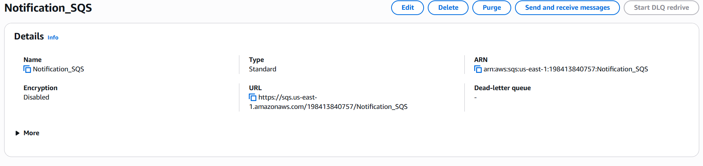
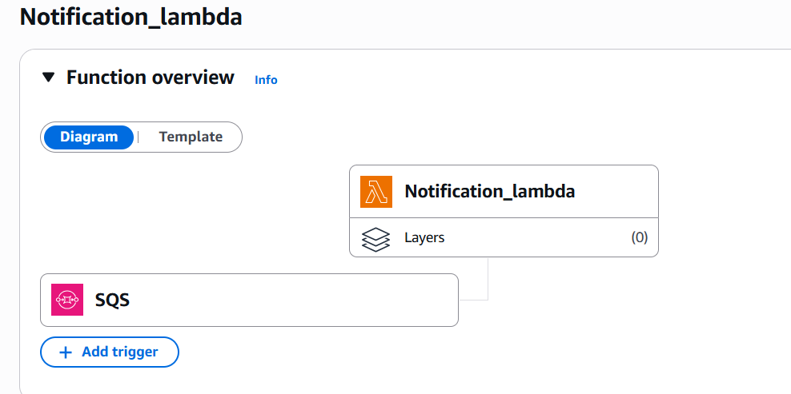

El usuario recibe un correo electrónico con la notificación correspondiente, asegurando una comunicación efectiva y oportuna sobre el estado de su solicitud de crédito.
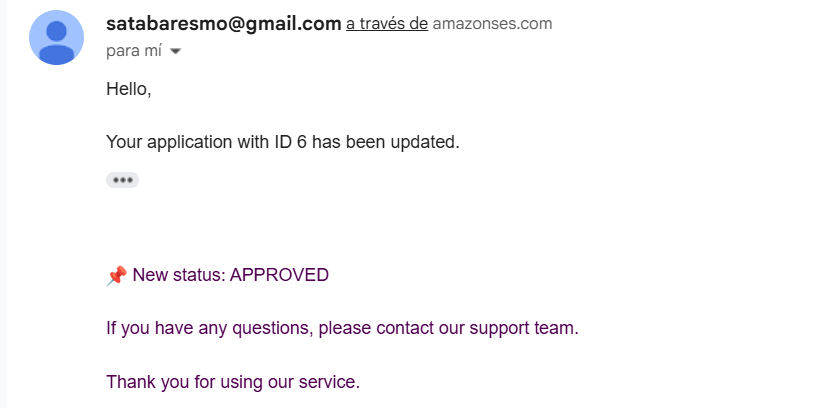

# Proceso de aprobación automática
El microservicio de solicitud de crédito incluye un proceso de aprobación automática que evalúa las solicitudes de crédito en función de ciertos criterios predefinidos. Este proceso se ejecuta automáticamente cuando una solicitud con tipo de crédito "revision automatica" es creada, enviando la solicitud a una cola SQS para su procesamiento en una lambda.

De ser aprobada, se actualiza el estado de la solicitud a "aprobada" y se notifica al usuario mediante correo electrónico junto al plan de pagos generado.

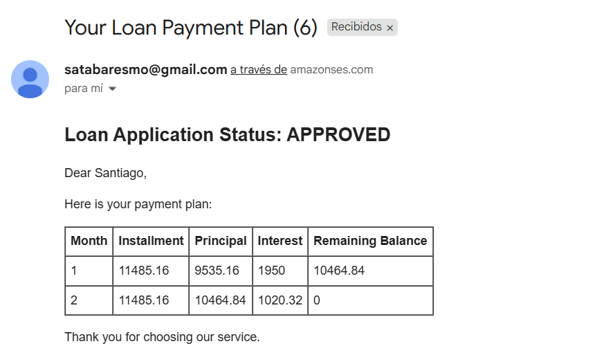


# Despliegue local con Docker

Para desplegar el microservicio localmente utilizando Docker, se proporciona un archivo `docker-compose.yml` que define los servicios necesarios, incluyendo la base de datos PostgreSQL y el propio microservicio. A continuación, se detallan los pasos para ejecutar el despliegue:
1. Asegúrate de tener Docker y Docker Compose instalados en tu máquina.
2. Ya que este repo se despliega junto a otros microservicios se establece el `docker-compose.yml` a un nivel superior, en este caso en la carpeta `crediya-authentication-service`
3. Se crea una carpeta llamada `scripts` y dentro de esta otra llamada `db_auth` donde se coaca el script `init.sql` para inicializar la base de datos con las tablas necesarias .
4. Se debe ejecutar el siguiente comando en la terminal, ubicado en la carpeta donde se encuentra el archivo `docker-compose.yml`:
   ```bash
   docker-compose up --build
   ```
5. Docker Compose se encargará de construir las imágenes necesarias y levantar los contenedores definidos

**Nota:** En la carpeta `deployment` se encuentran los archivos `Dockerfile`, `docker-compose.yml`, el script de inicialización de la BD utilizados para el despliegue.'

**Nota:** Hay un segundo `docker-compose-proxy.yml` en el cual se utiliza gninx como proxy inverso para gestionar las solicitudes a los microservicios. Para ell funcionamiento de este es necesario crear una carpeta llamada `nginx` y dentro de esta colocar el archivo `default.conf` que se encuentra en la carpeta `deployment`.


# Despliegue en AWS

El despliegue en AWS se realiza utilizando servicios como Amazon ECS (Elastic Container Service) para gestionar los contenedores Docker y Amazon RDS (Relational Database Service) para la base de datos PostgreSQL. A continuación, se describen los pasos generales para desplegar el microservicio en AWS:

1. Publicar imagen docker en Amazon ECR (Elastic Container Registry).


2. Crear una instancia de base de datos PostgreSQL en Amazon RDS.

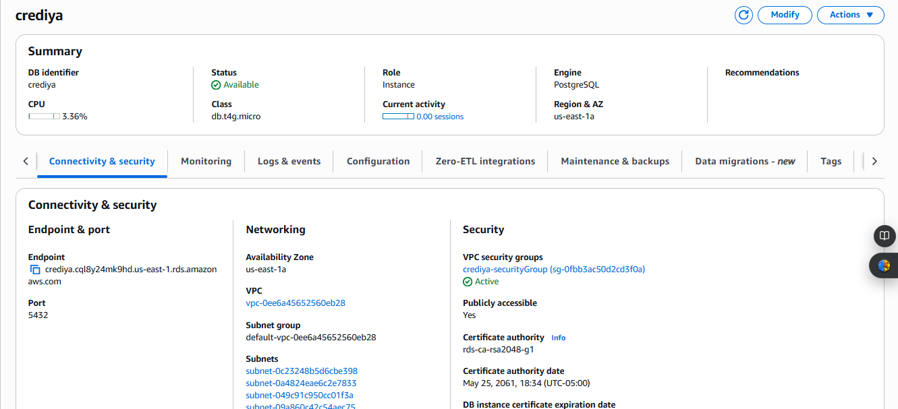

**Nota:** En ambiente local se utiliza una base de datos por cada microservicio, pero en AWS se utiliza una sola base de datos para todos los microservicios, separando la lógica por esquemas.

3. Configurar un clúster de Amazon ECS

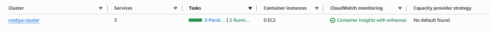


4. Definir una tarea que utilice la imagen Docker publicada en ECR.

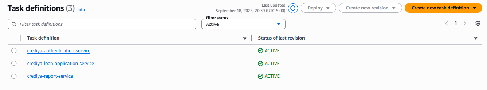

5. Crear los servicios en el clúster que ejecute la tarea definida.

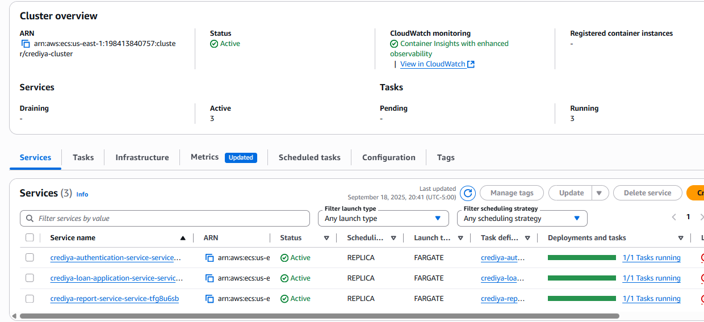

6. Configurar un Application Load Balancer (ALB) para distribuir el tráfico entre las instancias del servicio.
7. Ejecutar el servicio y verificar que esté funcionando correctamente.

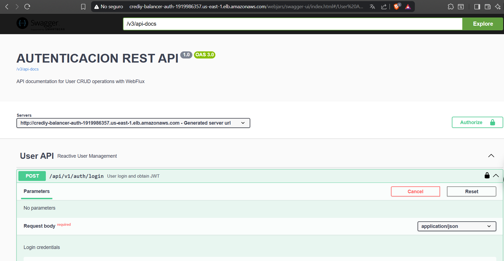
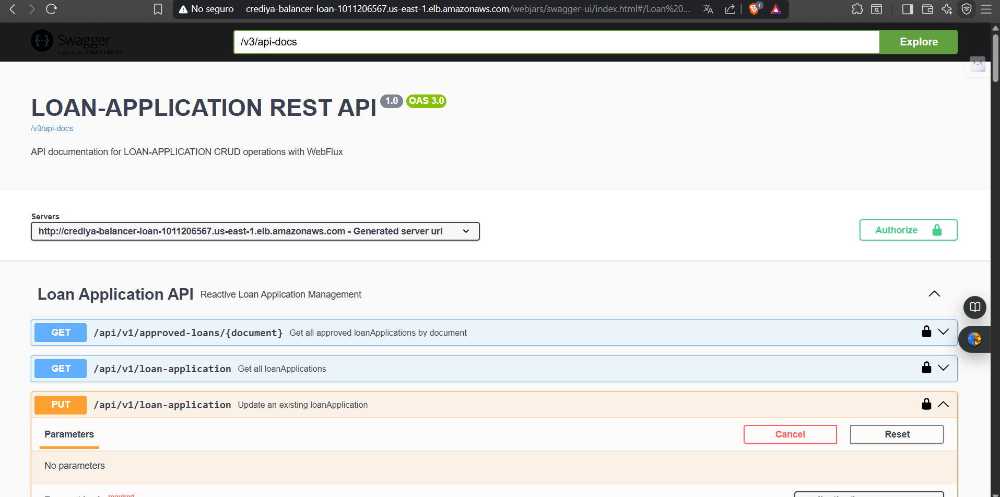
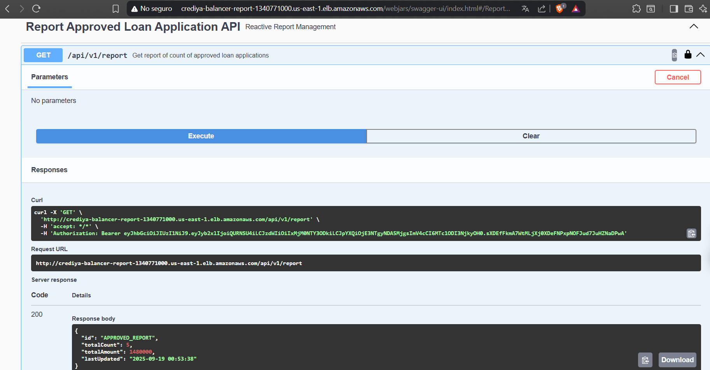
